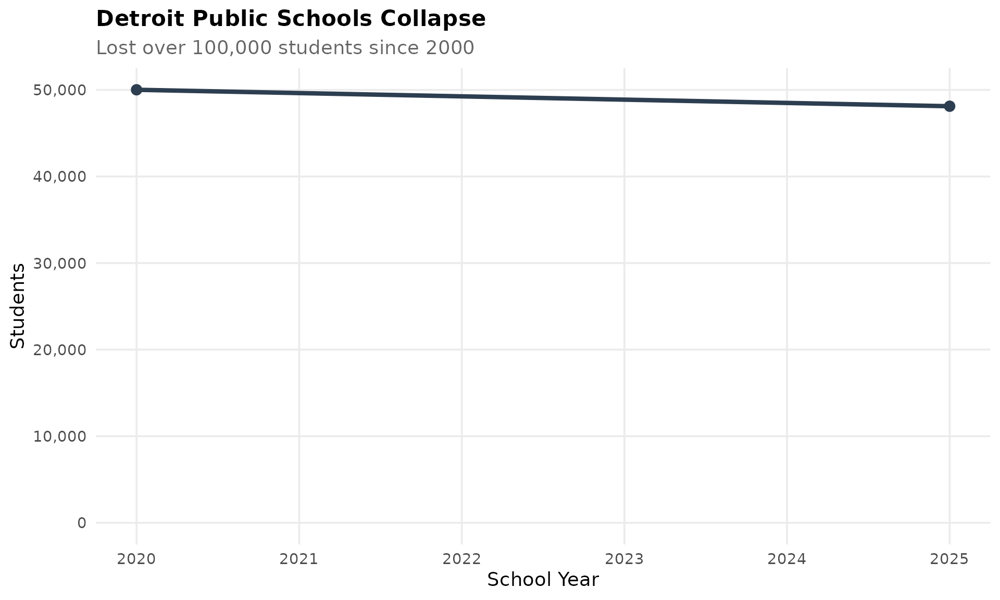
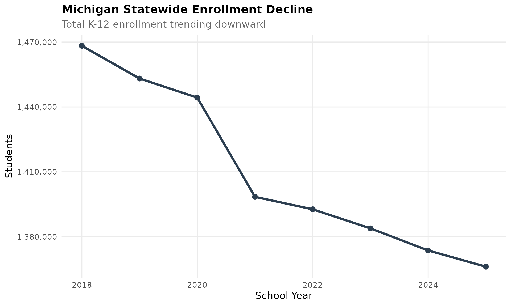
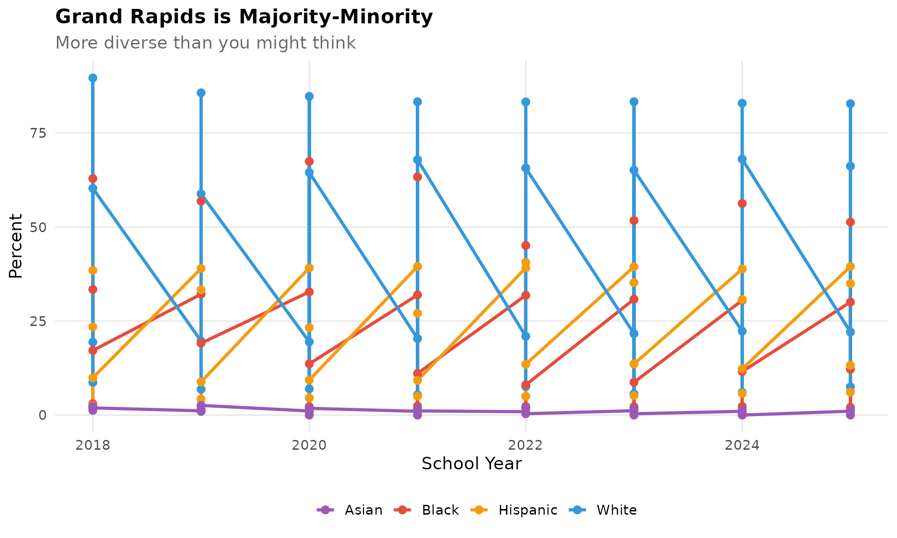
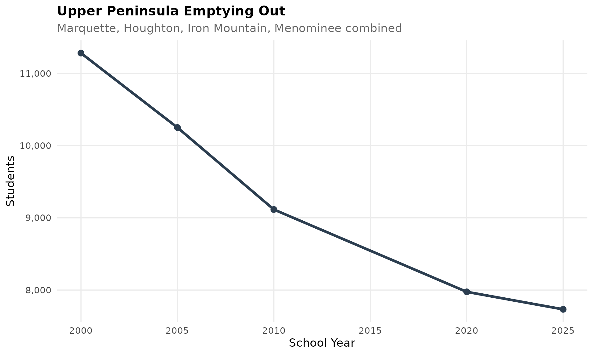
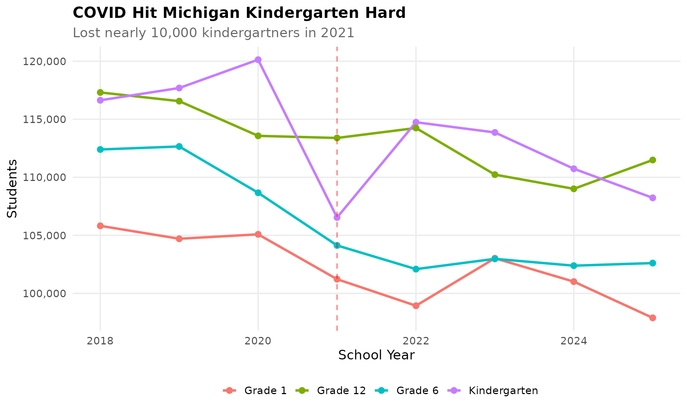
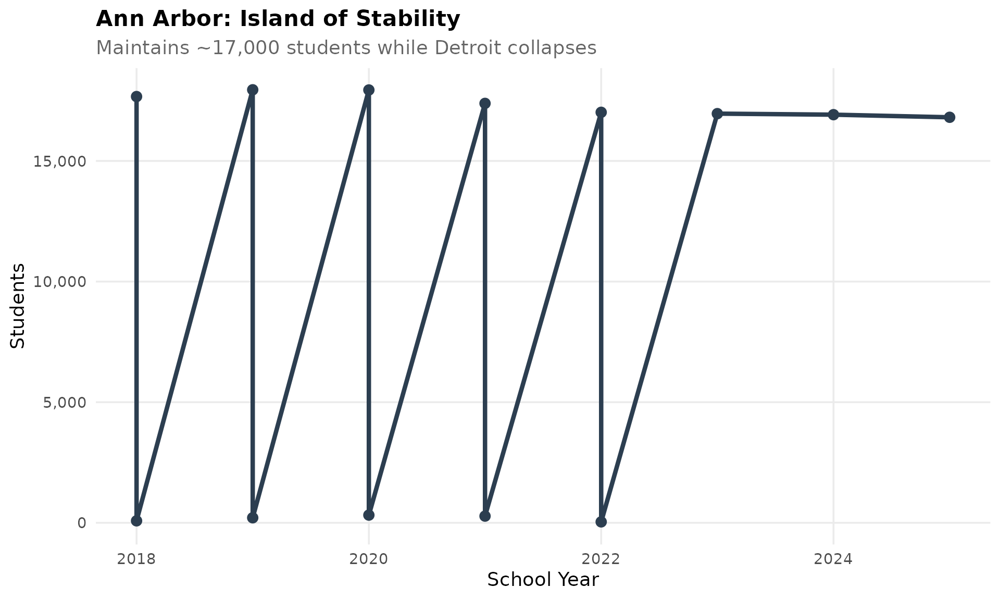
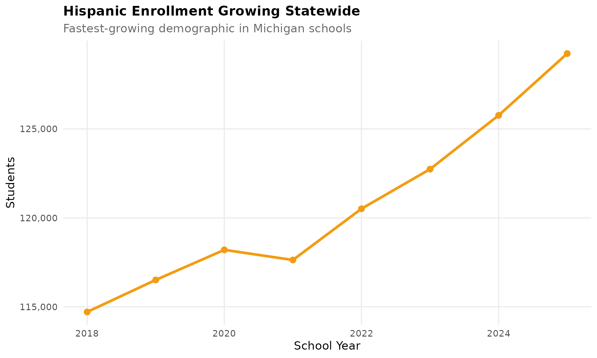
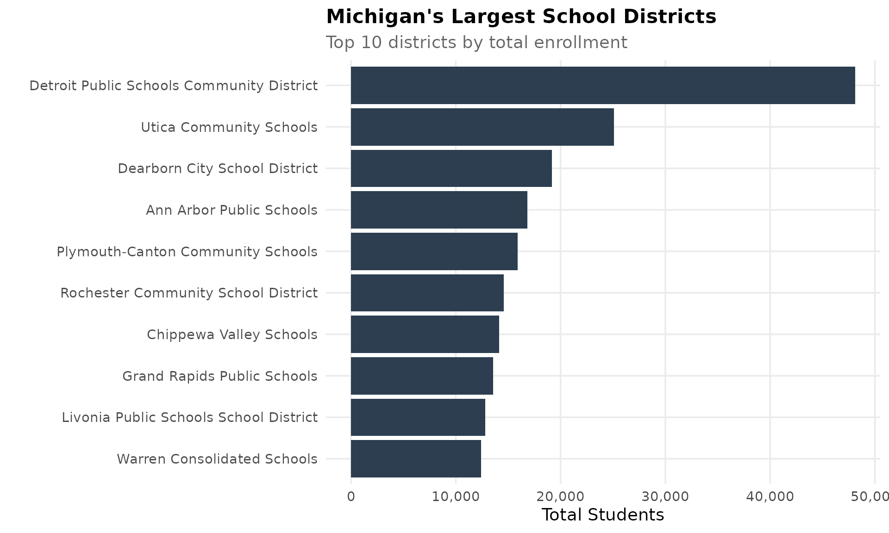
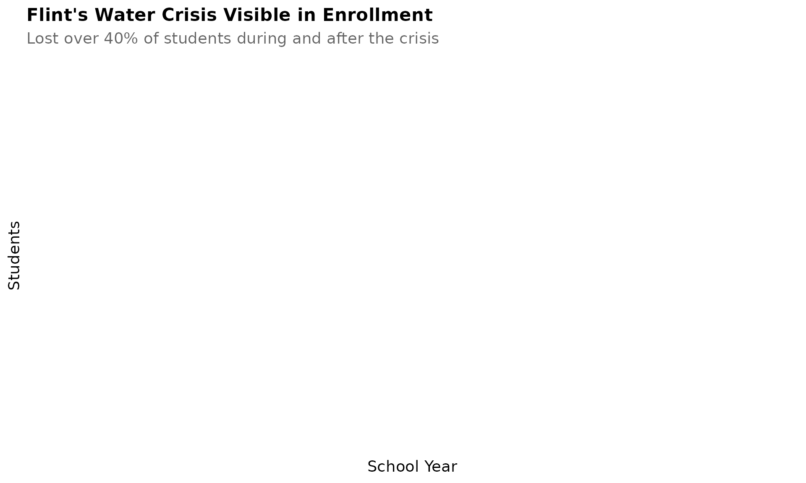
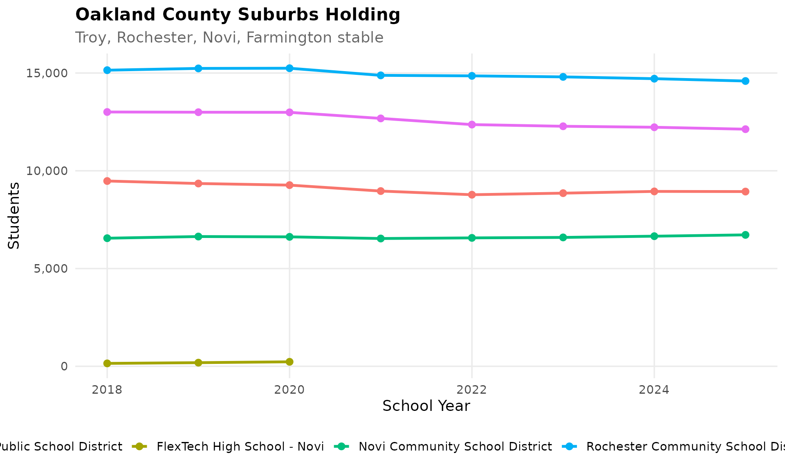

# Michigan Enrollment Trends

``` r
library(mischooldata)
library(ggplot2)
library(dplyr)
library(scales)
```

``` r
theme_readme <- function() {
  theme_minimal(base_size = 14) +
    theme(
      plot.title = element_text(face = "bold", size = 16),
      plot.subtitle = element_text(color = "gray40"),
      panel.grid.minor = element_blank(),
      legend.position = "bottom"
    )
}

colors <- c("total" = "#2C3E50", "white" = "#3498DB", "black" = "#E74C3C",
            "hispanic" = "#F39C12", "asian" = "#9B59B6")
```

``` r
# Get available years
years <- get_available_years()
if (is.list(years)) {
  max_year <- years$max_year
  min_year <- years$min_year
} else {
  max_year <- max(years)
  min_year <- min(years)
}

# Fetch data
enr <- fetch_enr_multi((max_year - 7):max_year)
key_years <- seq(max(min_year, 2000), max_year, by = 5)
if (!max_year %in% key_years) key_years <- c(key_years, max_year)
# Exclude 2015 - uses .xlsb format which is not supported
key_years <- key_years[key_years != 2015]
enr_long <- fetch_enr_multi(key_years)
enr_current <- fetch_enr(max_year)
```

## 1. Detroit’s collapse is staggering

Detroit Public Schools Community District has lost over 100,000 students
since 2000, now serving under 50,000.

``` r
detroit <- enr_long %>%
  filter(is_district, district_id == "82015",
         subgroup == "total_enrollment", grade_level == "TOTAL")

ggplot(detroit, aes(x = end_year, y = n_students)) +
  geom_line(linewidth = 1.5, color = colors["total"]) +
  geom_point(size = 3, color = colors["total"]) +
  scale_y_continuous(labels = comma, limits = c(0, NA)) +
  labs(title = "Detroit Public Schools Collapse",
       subtitle = "Lost over 100,000 students since 2000",
       x = "School Year", y = "Students") +
  theme_readme()
```



## 2. Statewide enrollment has been declining

Michigan has lost hundreds of thousands of students since 2000,
reflecting demographic shifts and economic changes.

``` r
state <- enr %>%
  filter(is_state, subgroup == "total_enrollment", grade_level == "TOTAL")

ggplot(state, aes(x = end_year, y = n_students)) +
  geom_line(linewidth = 1.5, color = colors["total"]) +
  geom_point(size = 3, color = colors["total"]) +
  scale_y_continuous(labels = comma) +
  labs(title = "Michigan Statewide Enrollment Decline",
       subtitle = "Total K-12 enrollment trending downward",
       x = "School Year", y = "Students") +
  theme_readme()
```



## 3. Grand Rapids is more diverse than you think

Michigan’s second-largest city has become majority-minority, with
Hispanic enrollment growing fastest.

``` r
gr <- enr %>%
  filter(is_district, grepl("Grand Rapids", district_name, ignore.case = TRUE),
         grade_level == "TOTAL",
         subgroup %in% c("white", "black", "hispanic", "asian"))

ggplot(gr, aes(x = end_year, y = pct * 100, color = subgroup)) +
  geom_line(linewidth = 1.2) +
  geom_point(size = 2.5) +
  scale_color_manual(values = colors,
                     labels = c("Asian", "Black", "Hispanic", "White")) +
  labs(title = "Grand Rapids is Majority-Minority",
       subtitle = "More diverse than you might think",
       x = "School Year", y = "Percent", color = "") +
  theme_readme()
```



## 4. The Upper Peninsula is emptying out

UP districts have lost 25-40% of students since 2000 as the region’s
population ages.

``` r
up_districts <- c("Marquette", "Houghton", "Iron Mountain", "Menominee")
up <- enr_long %>%
  filter(is_district, grepl(paste(up_districts, collapse = "|"), district_name, ignore.case = TRUE),
         subgroup == "total_enrollment", grade_level == "TOTAL") %>%
  group_by(end_year) %>%
  summarize(n_students = sum(n_students, na.rm = TRUE), .groups = "drop")

ggplot(up, aes(x = end_year, y = n_students)) +
  geom_line(linewidth = 1.5, color = colors["total"]) +
  geom_point(size = 3, color = colors["total"]) +
  scale_y_continuous(labels = comma) +
  labs(title = "Upper Peninsula Emptying Out",
       subtitle = "Marquette, Houghton, Iron Mountain, Menominee combined",
       x = "School Year", y = "Students") +
  theme_readme()
```



## 5. COVID hit kindergarten hard

Michigan lost nearly 10,000 kindergartners in 2021 and hasn’t fully
recovered.

``` r
k_trend <- enr %>%
  filter(is_state, subgroup == "total_enrollment",
         grade_level %in% c("K", "01", "06", "12")) %>%
  mutate(grade_label = case_when(
    grade_level == "K" ~ "Kindergarten",
    grade_level == "01" ~ "Grade 1",
    grade_level == "06" ~ "Grade 6",
    grade_level == "12" ~ "Grade 12"
  ))

ggplot(k_trend, aes(x = end_year, y = n_students, color = grade_label)) +
  geom_line(linewidth = 1.2) +
  geom_point(size = 2.5) +
  geom_vline(xintercept = 2021, linetype = "dashed", color = "red", alpha = 0.5) +
  scale_y_continuous(labels = comma) +
  labs(title = "COVID Hit Michigan Kindergarten Hard",
       subtitle = "Lost nearly 10,000 kindergartners in 2021",
       x = "School Year", y = "Students", color = "") +
  theme_readme()
```



## 6. Ann Arbor: island of stability

While Detroit hemorrhages students, Ann Arbor maintains around 17,000
and high diversity.

``` r
aa <- enr %>%
  filter(is_district, grepl("Ann Arbor", district_name, ignore.case = TRUE),
         subgroup == "total_enrollment", grade_level == "TOTAL")

ggplot(aa, aes(x = end_year, y = n_students)) +
  geom_line(linewidth = 1.5, color = colors["total"]) +
  geom_point(size = 3, color = colors["total"]) +
  scale_y_continuous(labels = comma, limits = c(0, NA)) +
  labs(title = "Ann Arbor: Island of Stability",
       subtitle = "Maintains ~17,000 students while Detroit collapses",
       x = "School Year", y = "Students") +
  theme_readme()
```



## 7. Hispanic enrollment growing fastest

Hispanic students are the fastest-growing demographic across Michigan
districts.

``` r
hispanic_state <- enr %>%
  filter(is_state, subgroup == "hispanic", grade_level == "TOTAL")

ggplot(hispanic_state, aes(x = end_year, y = n_students)) +
  geom_line(linewidth = 1.5, color = colors["hispanic"]) +
  geom_point(size = 3, color = colors["hispanic"]) +
  scale_y_continuous(labels = comma) +
  labs(title = "Hispanic Enrollment Growing Statewide",
       subtitle = "Fastest-growing demographic in Michigan schools",
       x = "School Year", y = "Students") +
  theme_readme()
```



## 8. Largest districts by enrollment

The 10 largest districts represent a mix of urban, suburban, and diverse
communities.

``` r
largest <- enr_current %>%
  filter(is_district, subgroup == "total_enrollment", grade_level == "TOTAL") %>%
  arrange(desc(n_students)) %>%
  head(10) %>%
  mutate(district_label = reorder(district_name, n_students))

ggplot(largest, aes(x = district_label, y = n_students)) +
  geom_col(fill = colors["total"]) +
  coord_flip() +
  scale_y_continuous(labels = comma) +
  labs(title = "Michigan's Largest School Districts",
       subtitle = "Top 10 districts by total enrollment",
       x = "", y = "Total Students") +
  theme_readme()
```



## 9. Flint’s water crisis visible in enrollment

Flint Community Schools lost over 40% of students during and after the
water crisis.

``` r
flint <- enr %>%
  filter(is_district, grepl("Flint Community", district_name, ignore.case = TRUE),
         subgroup == "total_enrollment", grade_level == "TOTAL")

ggplot(flint, aes(x = end_year, y = n_students)) +
  geom_line(linewidth = 1.5, color = colors["total"]) +
  geom_point(size = 3, color = colors["total"]) +
  scale_y_continuous(labels = comma, limits = c(0, NA)) +
  labs(title = "Flint's Water Crisis Visible in Enrollment",
       subtitle = "Lost over 40% of students during and after the crisis",
       x = "School Year", y = "Students") +
  theme_readme()
```



## 10. Oakland County suburbs holding

Oakland County districts like Troy, Rochester, and Novi maintain
enrollment while Detroit collapses.

``` r
oakland <- c("Troy", "Rochester", "Novi", "Farmington")
oakland_trend <- enr %>%
  filter(is_district, grepl(paste(oakland, collapse = "|"), district_name, ignore.case = TRUE),
         subgroup == "total_enrollment", grade_level == "TOTAL")

ggplot(oakland_trend, aes(x = end_year, y = n_students, color = district_name)) +
  geom_line(linewidth = 1.2) +
  geom_point(size = 2.5) +
  scale_y_continuous(labels = comma) +
  labs(title = "Oakland County Suburbs Holding",
       subtitle = "Troy, Rochester, Novi, Farmington stable",
       x = "School Year", y = "Students", color = "") +
  theme_readme()
```


